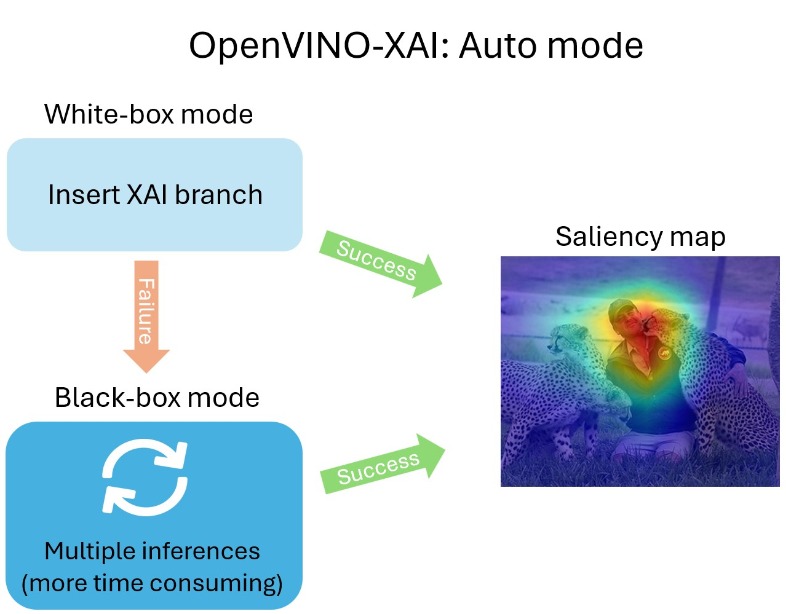

<div align="center">

# OpenVINO™ Explainable AI Toolkit - OpenVINO XAI

---

[Install](#installation)
[Quick start](#quick-start)
[Features](#features)
[Updates](#updates)
[License](#license)
[Documentation](https://openvinotoolkit.github.io/openvino_xai/)

---

</div>


**OpenVINO™ Explainable AI (XAI) Toolkit** provides a suite of XAI algorithms for visual explanation of
[OpenVINO™](https://github.com/openvinotoolkit/openvino) Intermediate Representation (IR) models.

## Installation

- Set up an isolated python environment for python 3.10 and higher:

```bash
# Create virtual env.
python3.10 -m venv .ovxai

# Activate virtual env.
source .ovxai/bin/activate
```

- Package installation:

```bash
# Package mode (for normal use):
pip install .

# Editable mode (for development):
pip install -e .[dev]
```

- Verification:

```bash
# Run tests
pytest -v -s ./tests/

# Run code quality checks
pre-commit run --all-files
```

## Quick Start

To explain [OpenVINO™](https://github.com/openvinotoolkit/openvino) Intermediate Representation (IR) you only need
preprocessing function (and sometimes postprocessing).

```python
explainer = xai.Explainer(
    model,
    task=xai.Task.CLASSIFICATION,
    preprocess_fn=preprocess_fn,
)
explanation = explainer(data, explanation_parameters)
```

By default the model will be explained using `auto mode`.
Under the hood of the `auto mode`: will try to run `white-box mode`, if fails => will run `black-box mode`.



Generating saliency maps involves model inference. Explainer will perform model inference.
To infer, `preprocess_fn` and `postprocess_fn` are requested from the user.
`preprocess_fn` is always required, `postprocess_fn` is required only for black-box.

```python
import cv2
import numpy as np
import openvino.runtime as ov

import openvino_xai as xai
from openvino_xai.explainer.explanation_parameters import ExplanationParameters


def preprocess_fn(x: np.ndarray) -> np.ndarray:
    # Implementing own pre-process function based on model's implementation
    x = cv2.resize(src=x, dsize=(224, 224))
    x = np.expand_dims(x, 0)
    return x


# Creating model
model = ov.Core().read_model("path/to/model.xml")  # type: ov.Model

# Explainer object will prepare and load the model once in the beginning
explainer = xai.Explainer(
    model,
    task=xai.Task.CLASSIFICATION,
    preprocess_fn=preprocess_fn,
)

# Generate and process saliency maps (as many as required, sequentially)
image = cv2.imread("path/to/image.jpg")
explanation_parameters = ExplanationParameters(
    target_explain_labels=[11, 14],  # indices or string labels to explain
)
explanation = explainer(image, explanation_parameters)

explanation: Explanation
explanation.saliency_map: Dict[int: np.ndarray]  # key - class id, value - processed saliency map e.g. 354x500x3

# Saving saliency maps
explanation.save("output_path", "name")
```

See more usage scenarios in the [user guide](docs/source/user-guide.md) and [examples](./examples).

### Running example scripts

```python
# Retrieve OTX models by running tests
# Models are downloaded and stored in .data/otx_models
pytest tests/test_classification.py

# Run a bunch of classification examples
# All outputs will be stored in the corresponding output directory
python examples/run_classification.py .data/otx_models/mlc_mobilenetv3_large_voc.xml \
tests/assets/cheetah_person.jpg --output output
```

## Features

### Scope of explained models

Models from [Pytorch Image Models (timm)](https://github.com/huggingface/pytorch-image-models) are used
for classification benchmark.

### White-box (fast, model-dependent)

#### Classification

We benchmarked white-box explanation (using ReciproCAM explain method) using 528 models.
Currently, we support only CNN-based architectures in white-box mode,
transformers will be supported in the upcoming weeks.

For more details (statistic, model list, samples of generated saliency maps) see
[#20](https://github.com/openvinotoolkit/openvino_xai/pull/20).

### Black-box (slow, model-agnostic)

#### Classification

We benchmarked black-box explanation (using RISE explain method) using 528 CNN models and 115 transformer-based models.
Black-box explainer support all types of models that output logits (e.g. CNNs, transformers, etc.).

For more details (statistic, model list, samples of generated saliency maps) see
[#20](https://github.com/openvinotoolkit/openvino_xai/pull/20).

---

## Updates

### v1.0.0

* Support generation of classification and detection per-class and per-image saliency maps
* Enable white-box (ReciproCAM) and black-box (RISE) eXplainable AI algorithms
* Support CNN and transformer-based architectures (validation on diverse set of timm models)
* Enable Explainer (stateful object) as the main interface for XAI algorithms
* Expose `insert_xai` functional API to support XAI head insertion for OpenVINO IR models

### Release History

Please refer to the [CHANGELOG.md](CHANGELOG.md)

---

## License

OpenVINO™ Toolkit is licensed under [Apache License Version 2.0](LICENSE).
By contributing to the project, you agree to the license and copyright terms therein and release your contribution under these terms.

---

## Issues / Discussions

Please use [Issues](https://github.com/openvinotoolkit/openvino_xai/issues/new) tab for your bug reporting, feature request, or any questions.

---

## Disclaimer

Intel is committed to respecting human rights and avoiding complicity in human rights abuses.
See Intel's [Global Human Rights Principles](https://www.intel.com/content/www/us/en/policy/policy-human-rights.html).
Intel's products and software are intended only to be used in applications that do not cause or contribute to a violation of an internationally recognized human right.

---

## Contributing

For those who would like to contribute to the library, see [CONTRIBUTING.md](CONTRIBUTING.md) for details.

Thank you! We appreciate your support!

<a href="https://github.com/openvinotoolkit/openvino_xai/graphs/contributors">
  
</a>

---
