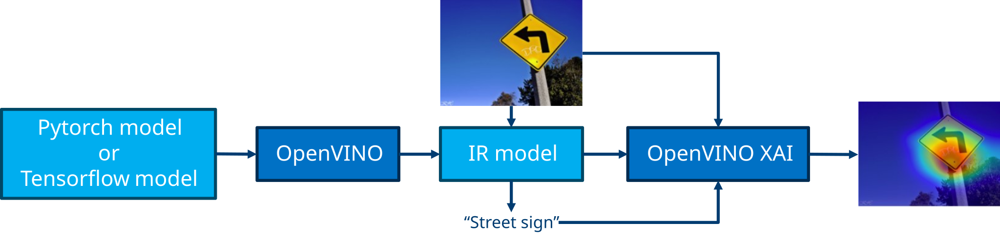
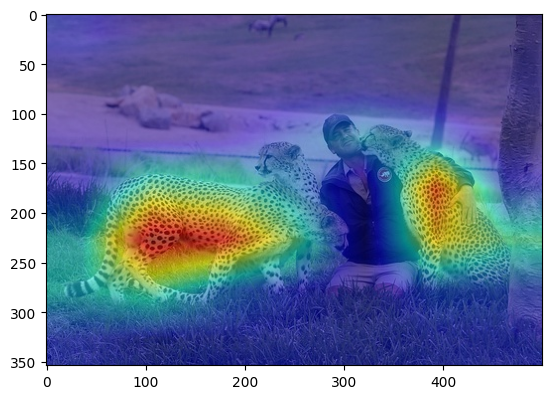

<div align="center">

# OpenVINO™ Explainable AI Toolkit - OpenVINO XAI

---

[Features](#features) •
[Install](#installation) •
[Quick Start](#quick-start) •
[License](#license) •
[Documentation](https://openvinotoolkit.github.io/openvino_xai/)

---

</div>



**OpenVINO™ Explainable AI (XAI) Toolkit** provides a suite of XAI algorithms for visual explanation of
[**OpenVINO™**](https://github.com/openvinotoolkit/openvino) Intermediate Representation (IR) models.

Given **OpenVINO** models and input images, **OpenVINO XAI** generates **saliency maps**
which highlights regions of the interest in the inputs from the models' perspective
to help users understand the reason why the complex AI models output such responses.

---

## Features

### What's new in v1.0.0

* Support generation of classification and detection per-class and per-image saliency maps
* Enable white-box (ReciproCAM) and black-box (RISE) eXplainable AI algorithms
* Support CNNs and Transformer-based architectures (validation on diverse set of timm models)
* Enable Explainer (stateful object) as the main interface for XAI algorithms
* Expose `insert_xai` functional API to support XAI head insertion for OpenVINO IR models

Please refer to the [change logs](CHANGELOG.md) for the full release history.

### Supported XAI methods

At the moment, *Image Classification* and *Object Detection* tasks are supported for the *Computer Vision* domain.
*Black-Box* (model agnostic but slow) methods and *White-Box* (model specific but fast) methods are supported:

| Domain          | Task                 | Type      | Algorithm           | Links |
|-----------------|----------------------|-----------|---------------------|-------|
| Comptuer Vision | Image Classification | Black-Box | RISE                | [arxiv](https://arxiv.org/abs/1806.07421v3) / [src](openvino_xai/methods/black_box/rise.py) |
|                 |                      | White-Box | ReciproCAM          | [arxiv](https://arxiv.org/abs/2209.14074) / [src](openvino_xai/methods/white_box/recipro_cam.py) |
|                 |                      |           | VITReciproCAM       | [arxiv](https://arxiv.org/abs/2310.02588) / [src](openvino_xai/methods/white_box/recipro_cam.py) |
|                 |                      |           | ActivationMap       | experimental / [src](openvino_xai/methods/white_box/activation_map.py) |
|                 | Object Detection     |           | ClassProbabilityMap | experimental / [src](openvino_xai/methods/white_box/det_class_probability_map.py) |

### Supported explainable models

Most of CNNs and Transformer models from [Pytorch Image Models (timm)](https://github.com/huggingface/pytorch-image-models) are supported and validated.

Please refer to the following kwnon issues for unsupported models.

* [Runtime error from ONNX / OpenVINO IR models while conversion or inference for XAI (#29)](https://github.com/openvinotoolkit/openvino_xai/issues/29)
* [Models not supported by white box XAI methods (#30)](https://github.com/openvinotoolkit/openvino_xai/issues/30)

> **_NOTE:_**  GenAI / LLMs would be also supported incrementally in the upcoming releases.

---

## Installation

> **_NOTE:_**  OpenVINO XAI works on Python 3.10 or higher

<details>
<summary>Set up environment</summary>

```bash
# Create virtual env.
python3.10 -m venv .ovxai

# Activate virtual env.
source .ovxai/bin/activate
```
</details>

Install from PyPI package

```bash
# Base package (for normal use):
pip install openvino_xai

# Dev package (for development):
pip install openvino_xai[dev]
```

<details>
<summary>Install from source</summary>

```bash
# Clone the source repository
git clone https://github.com/openvinotoolkit/openvino_xai.git
cd openvino_xai

# Editable mode (for development):
pip install -e .[dev]
```
</details>

<details>
<summary>Verify installation</summary>

```bash
# Run tests
pytest -v -s ./tests/unit

# Run code quality checks
pre-commit run --all-files
```
</details>

---

## Quick Start

To explain [OpenVINO™](https://github.com/openvinotoolkit/openvino) Intermediate Representation (IR) you only need
preprocessing function (and sometimes postprocessing).

```python
explainer = xai.Explainer(
    model,
    task=xai.Task.CLASSIFICATION,
    preprocess_fn=preprocess_fn,
)
explanation = explainer(data, explanation_parameters)
```

By default the model will be explained using `auto mode`.
Under the hood of the `auto mode`: will try to run `white-box mode`, if fails => will run `black-box mode`.

Generating saliency maps involves model inference. Explainer will perform model inference.
To infer, `preprocess_fn` and `postprocess_fn` are requested from the user.
`preprocess_fn` is always required, `postprocess_fn` is required only for black-box.

```python
import cv2
import numpy as np
import openvino.runtime as ov

import openvino_xai as xai
from openvino_xai.explainer.explanation_parameters import ExplanationParameters


def preprocess_fn(x: np.ndarray) -> np.ndarray:
    # Implementing own pre-process function based on model's implementation
    x = cv2.resize(src=x, dsize=(224, 224))
    x = np.expand_dims(x, 0)
    return x


# Creating model
model = ov.Core().read_model("path/to/model.xml")  # type: ov.Model

# Explainer object will prepare and load the model once in the beginning
explainer = xai.Explainer(
    model,
    task=xai.Task.CLASSIFICATION,
    preprocess_fn=preprocess_fn,
)

# Generate and process saliency maps (as many as required, sequentially)
image = cv2.imread("path/to/image.jpg")
explanation_parameters = ExplanationParameters(
    target_explain_labels=[11, 14],  # indices or string labels to explain
)
explanation = explainer(image, explanation_parameters)

explanation: Explanation
explanation.saliency_map: Dict[int: np.ndarray]  # key - class id, value - processed saliency map e.g. 354x500x3

# Saving saliency maps
explanation.save("output_path", "name")
```


### More advanced use-cases

Users could tweak the basic use-case according to their purpose, which include but not limited to:

* Select XAI mode (White-Box or Black-Box) or even specific method which are automatically decided by default
* Provide custom model pre/post processing functions
* Customize output image visualization options

Please find more options and scenarios in the following links:

* [OpenVINO XAI User Guide](docs/source/user-guide.md)
* [OpenVINO Notebook - XAI Deep Dive]()

### Running example scripts

Please look around the runnable [example scripts](./examples) and play with them to get used to the `Exaplainer` APIs.

```bash
# Prepare models by running tests (need "pip install openvino_xai[dev]" extra option)
# Models are downloaded and stored in .data/otx_models
pytest tests/test_classification.py

# Run a bunch of classification examples
# All outputs will be stored in the corresponding output directory
python examples/run_classification.py .data/otx_models/mlc_mobilenetv3_large_voc.xml \
tests/assets/cheetah_person.jpg --output output
```

---

## License

OpenVINO™ Toolkit is licensed under [Apache License Version 2.0](LICENSE).
By contributing to the project, you agree to the license and copyright terms therein and release your contribution under these terms.

---

## Issues / Discussions

Please use the [Issues tab](https://github.com/openvinotoolkit/openvino_xai/issues/new) for bug reports, feature requests, or any questions.

---

## Disclaimer

Intel is committed to respecting human rights and avoiding complicity in human rights abuses.
See Intel's [Global Human Rights Principles](https://www.intel.com/content/www/us/en/policy/policy-human-rights.html).
Intel's products and software are intended only to be used in applications that do not cause or contribute to a violation of an internationally recognized human right.

---

## Contributing

For those who would like to contribute to the library, please refer to the [contribution guide](CONTRIBUTING.md) for details.

Thank you! We appreciate your support!

<a href="https://github.com/openvinotoolkit/openvino_xai/graphs/contributors">
  
</a>

---
